# Reg-PINNs
This respository demonstrate Regression-based Physics Informed Neural Networks for Magnetopause Tracking

## Abstract
The ultimate goal of studying the magnetopause position is to accurately determine its location. Both traditional numerical computation methods and the currently popular machine learning approaches have shown promising results. In this study, we propose a Regression-based Physics-Informed Neural Networks (Reg-PINNs) that combines physics-based numerical computation with vanilla machine learning. This new generation of PINNs overcomes the limitations of previous methods restricted to solving ordinary and partial differential equations by incorporating conventional empirical models to aid the convergence and enhance the generalization capability of the neural network. Compared to Shue et al. [1998], our model achieves a reduction of approximately 30% in root mean square error.

The methodology presented in this study is not only applicable to space research but can also be referenced in studies across various fields, particularly those involving empirical models.

### Re-evaluation for Bz, Dp to Alpha, r_0
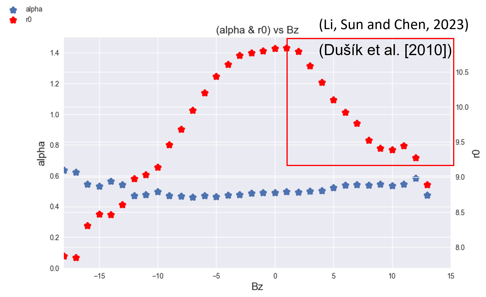

### Proposed Numerical Model
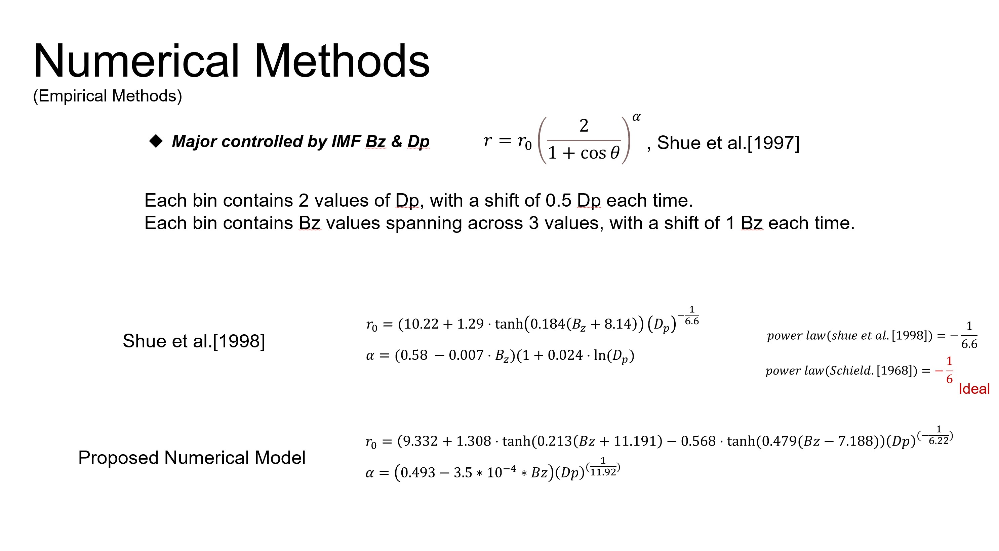

-------------------------------------------------------------------------------------
## General Form of Regression-based Physics Informed Neural Networks (Reg-PINNs)
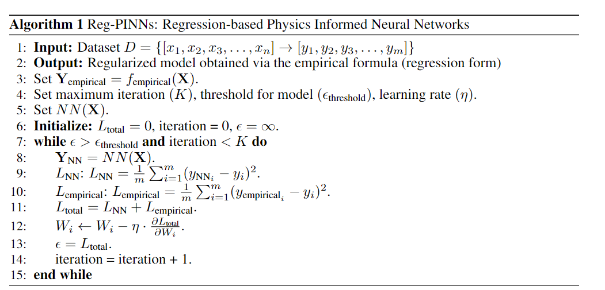

### The functional flow block diagram in this research
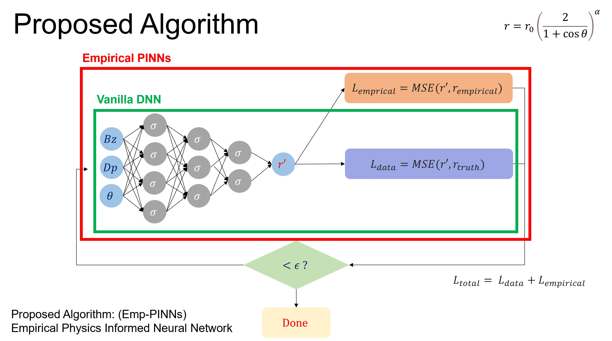

### Training Loss
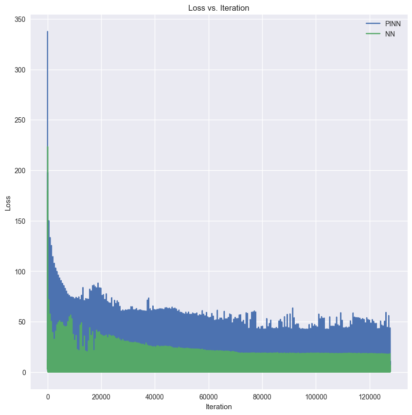

### prediction of r for every model

  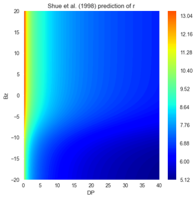
  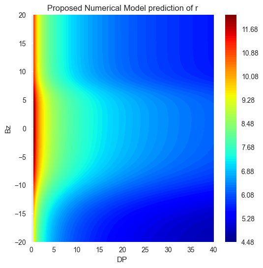
  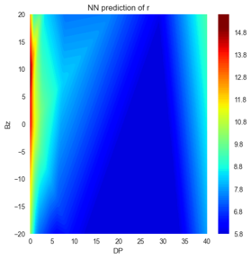
  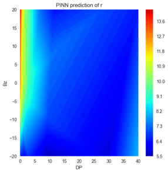
  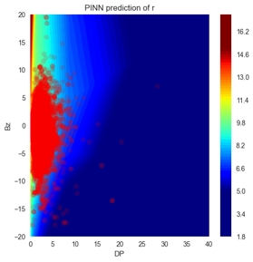

## Evaluation
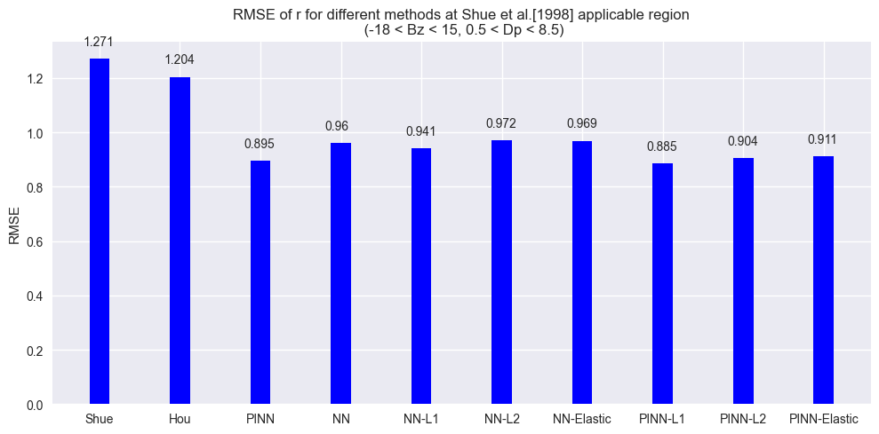

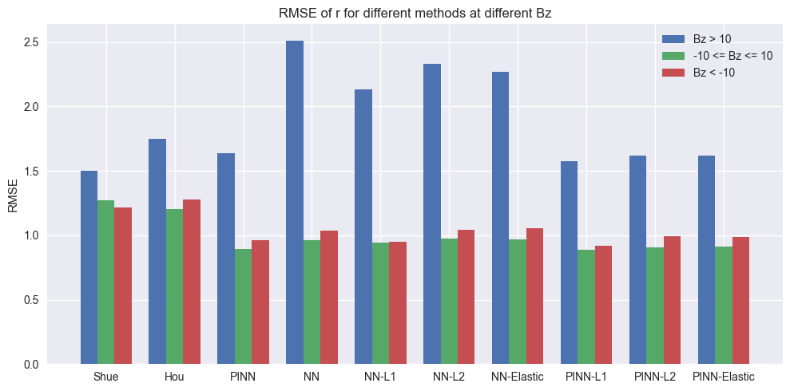

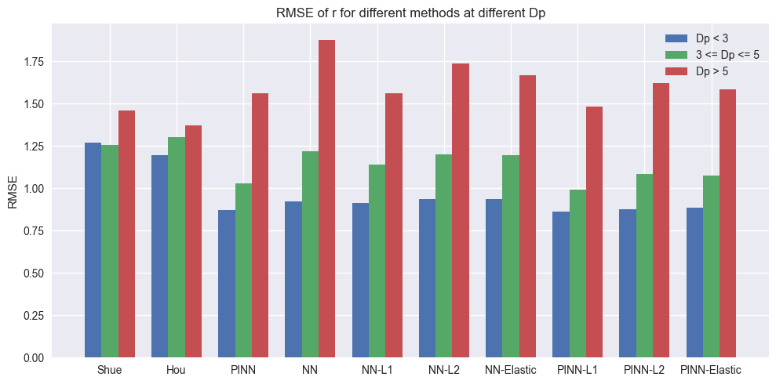

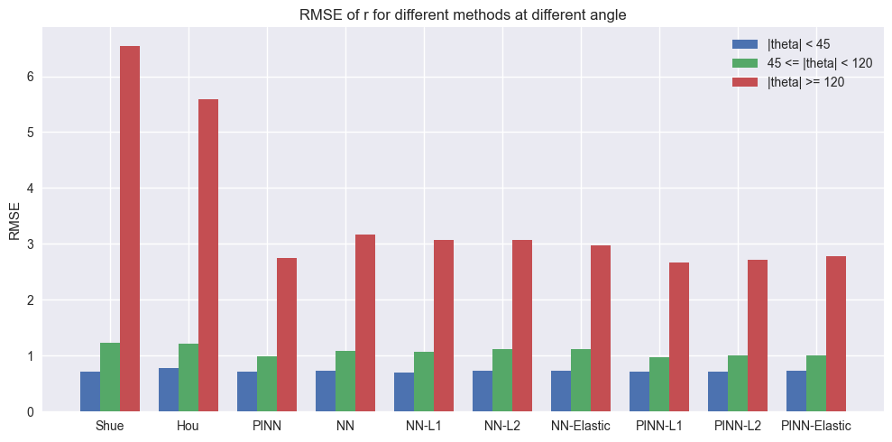

# Conclusion
- We re-evaluate the relationship between parameters (Bz, Dp) and 𝑟_0   and 𝛼, and propose alternative types of empirical models.

- The proposed algorithm (Reg-PINNs) resolves the issues of empirical methods' inherent lack of precision and the poor generalization capabilities of machine learning.

- Reg-PINNs is an algorithm that constrains vanilla neural networks to converge on predictions and enhances generalization by excluding intervening outliers.

- Reg – PINNs is capable of handling multivariate input and multivariate output. However, in this study, we only focus on discussing the prediction of magnetopause locations in the space domain, considering multivariate inputs and a single output.

- The proposed Reg-PINNs introduced in this study allows the incorporation of algebraic equations for model training, expanding the capabilities of traditional PINNs, which primarily focus on solving ordinary and partial differential equations (ODEs and PDEs).

- Reg-PINNs greatly improve the model's performance in predicting the location of the Magnetopause, achieving a remarkably improvement of 29.8 %.

- L1 (Lasso), L2 (Ridge), and Elastic regularization techniques show a significant improvement in predicting the variable r when Bz varies..

- Reg-PINNs significantly improves the precision within the applicable scope of Shue et al. [1998].

