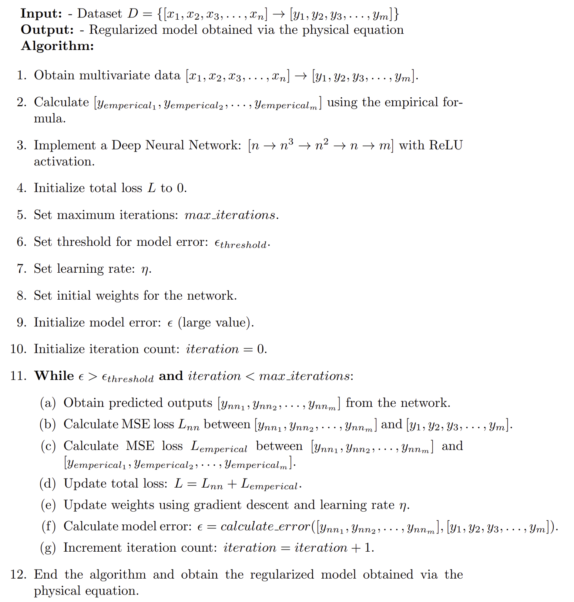

# Emp-PINNs
This respository demonstrate Empirical-Physics Informed Neural Networks for Magnetopause Tracking

## Abstract
The ultimate goal of studying the magnetopause position is to accurately determine its location. Both traditional numerical computation methods and the currently popular machine learning approaches have shown promising results. In this study, we propose a Empirical Physics-Informed Neural Networks (Emp-PINNs) that combines physics-based numerical computation with vanilla machine learning. This new generation of PINNs overcomes the limitations of previous methods restricted to solving ordinary and partial differential equations by incorporating conventional empirical models to aid the convergence and enhance the generalization capability of the neural network. Compared to Shue et al. [1998], our model achieves a reduction of approximately 30% in root mean square error.

The methodology presented in this study is not only applicable to space research but can also be referenced in studies across various fields, particularly those involving empirical models.

### Re-evaluation for Bz, Dp to Alpha, r_0

### Proposed Numerical Model

-------------------------------------------------------------------------------------
## General Form of Empirical Physics Informed Neural Networks (Emp-PINNs)

### The functional flow block diagram in this research

